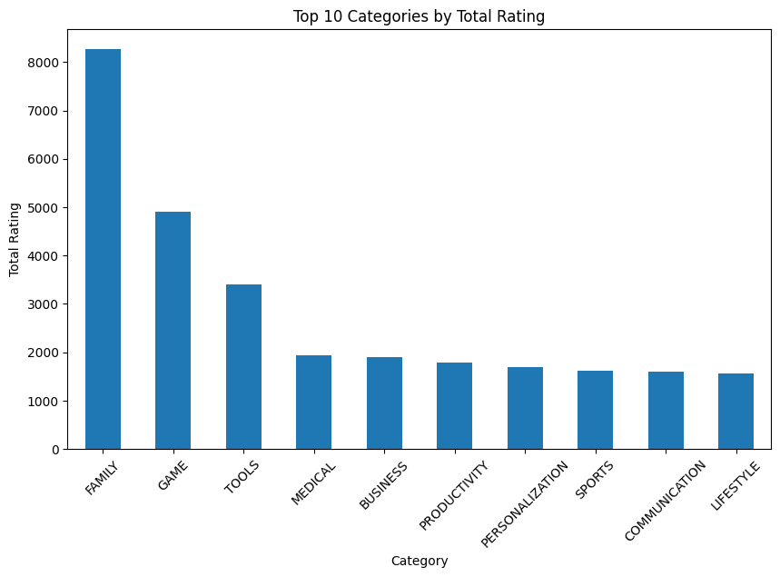
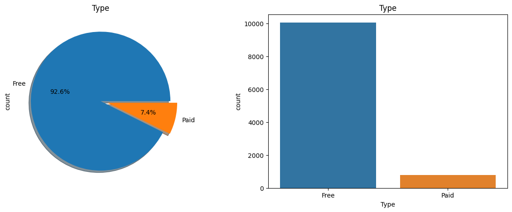
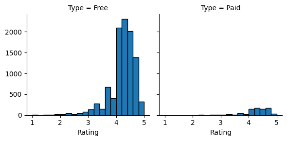
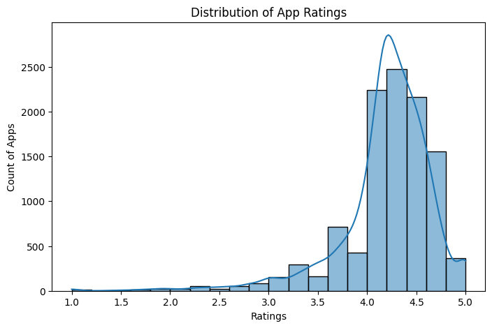

# Google Play Store Data Analysis

## Project Overview
This project analyzes the Google Play Store dataset to uncover insights about app ratings, categories, pricing, installs, and user engagement.

## Objectives
- Clean and preprocess the dataset
- Perform exploratory data analysis (EDA)
- Identify trends and patterns
- Visualize insights using Python

## Tools Used
- Python
- Pandas
- NumPy
- Matplotlib
- Seaborn
- Google Colab

## Key Insights
- Most common app categories
- Rating distributions
- Free vs Paid apps analysis
- Correlation between numerical features
- User engagement trends

## Repository Structure

├── Data_Analysis_task_Anas_Marashdeh.ipynb
├── googleplaystore.csv
└── README.md

## Sample Visualizations

## Author

Anas Marashdeh
